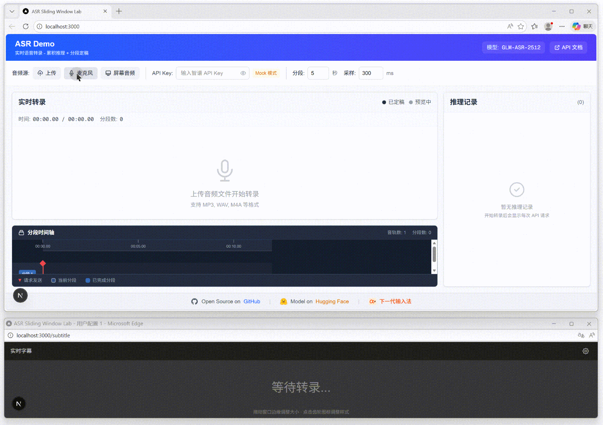

# GLM-ASR-Playground

A real-time speech-to-text playground powered by the [Zhipu GLM-ASR API](https://docs.bigmodel.cn/api-reference/%E6%A8%A1%E5%9E%8B-api/%E8%AF%AD%E9%9F%B3%E8%BD%AC%E6%96%87%E6%9C%AC). Upload audio, record your mic, or capture system audio and watch incremental and finalized transcripts update live.

**[Live Demo](https://pekingspades.github.io/GLM-ASR-Playground/)** | **[中文文档](./README_zh.md)**



## Highlights

- **Multiple Audio Sources**
  - Upload audio files (WAV, MP3)
  - Microphone recording
  - Screen capture (system audio; browser support required)

- **Streaming Transcription**
  - Incremental preview with finalized segments
  - Configurable segment duration and chunk interval

- **Developer Tools**
  - Request/response inspector for inference debugging
  - Multi-track timeline view
  - Pop-out subtitle window (BroadcastChannel API)

- **Mock Mode**
  - Explore the UI without an API key

## Tech Stack

- [Next.js](https://nextjs.org/) 16
- [React](https://react.dev/) 19
- [Tailwind CSS](https://tailwindcss.com/) 4
- TypeScript

## Quick Start

### Prerequisites

- Node.js 18+
- npm / yarn / pnpm

### Install

```bash
git clone https://github.com/PekingSpades/GLM-ASR-Playground.git
cd GLM-ASR-Playground
npm install
```

### Develop

```bash
npm run dev
```

Open [http://localhost:3000](http://localhost:3000) in your browser.

### Build

```bash
npm run build
```

### Static Export (GitHub Pages)

This project is configured for static export. After building, the static files are in the `out` directory.
If you deploy under a different repository name, update `basePath` and `assetPrefix` in `next.config.ts`.

## Usage

1. **Get an API Key**: Register at [Zhipu AI Platform](https://open.bigmodel.cn/) and obtain your API key.
2. **Enter the API Key**: Paste it in the settings panel. The key is stored locally and only sent to Zhipu's API.
3. **Select an Audio Source**:
   - Click "Upload" to choose an audio file
   - Click "Microphone" to record from your mic
   - Click "Screen" to capture system audio (requires browser support)
4. **Start Transcription**: Click the play button to begin real-time transcription.
5. **Review Results**:
   - Confirmed text appears in blue
   - Preview text (current segment) appears in gray
   - Use the timeline to navigate segments
   - Click "Subtitle" to open a pop-out subtitle window

## Configuration

| Option | Default | Description |
|--------|---------|-------------|
| Segment Duration | 10s | Duration before finalizing a segment |
| Chunk Interval | 200ms | Interval between inference requests |
| Model | GLM-ASR-2512 | Zhipu ASR model to use |

## API Reference

This project uses the [Zhipu GLM-ASR API](https://docs.bigmodel.cn/api-reference/%E6%A8%A1%E5%9E%8B-api/%E8%AF%AD%E9%9F%B3%E8%BD%AC%E6%96%87%E6%9C%AC).

## Related Projects

- [GLM-ASR](https://github.com/zai-org/GLM-ASR) - Official GLM-ASR model repository
- [GLM-ASR-Nano-2512](https://huggingface.co/zai-org/GLM-ASR-Nano-2512) - Model on Hugging Face

## Roadmap

- [ ] **VAD (Voice Activity Detection)** - Intelligent segmentation based on speech detection, splitting at natural pauses instead of fixed intervals
- [ ] **Sliding Window** - Overlapping audio chunks to reduce boundary errors

## License

This project is licensed under the MIT License - see the [LICENSE](LICENSE) file for details.

## Acknowledgments

- [Zhipu AI](https://www.zhipuai.cn/) for the GLM-ASR API
- [Next.js](https://nextjs.org/) team for the framework
